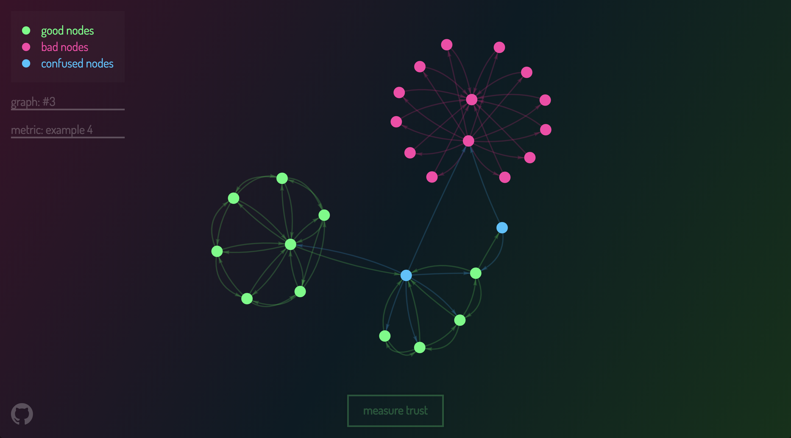

# wot-vis
Web of Trust Visualizer :cherry_blossom:

This is a visualizer to accompany [my paper on measuring trust](https://github.com/WebOfTrustInfo/rwot7/blob/master/supporting-files/measuring-trust.pdf). The abstract is included below.

https://wot-vis.firebaseapp.com

## Abstract

> “I'm not reading a good review on Yelp.”

> “That's not good, hmm? Mmm, you know what? Fuck it, 'cause this is usually just one pissed off dude who had a bad experience and then wrote, like, 50 bad reviews.”

This is an excerpt from the Netflix show Love (season 1, episode 5). It’s a trivial example of the more general problem of Sybil attacks, situations where a malicious actor games a system that relies on the assumption of unique identity by creating numerous fake accounts.

The concept of an open and permissionless system is philosophically appealing. However, there are certain applications that require the concept of trusted identities. At a minimum, all systems that involve voting rely on unique, trustworthy identities to cast a vote. This includes any consensus mechanism as well as any rating system. Such systems face a dilemma: how can we filter out bad actors without a centralized authority?

In this paper, I propose the concept of deriving relative trust scores using a given trust metric, one score for each identity from the perspective of another, in a web of trust. I then offer as examples multiple trust metrics, propose the concept of relative reputation, and explore the the idea of obtaining social consensus from a web of trust using trust scores.

[Read the rest of the paper.](https://github.com/WebOfTrustInfo/rwot7/blob/master/supporting-files/measuring-trust.pdf)
